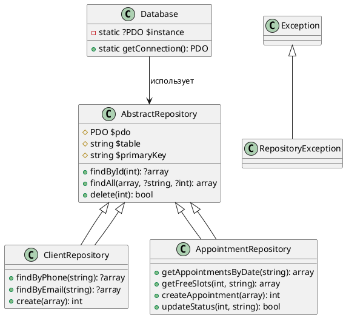

# Отчёт: Уровень доступа к данным (Data Access Layer)

## 1. Архитектура решения
Уровень доступа к данным реализован на основе паттерна Repository. Абстрактный класс `AbstractRepository` инкапсулирует общую логику работы с PDO (подключение, базовые SELECT/DELETE, безопасная сборка WHERE и ORDER BY). Для каждой предметной таблицы создан наследник (`ClientRepository`, `AppointmentRepository` и др.), добавляющий бизнес-специфичные методы. Класс `Database` управляет соединением через Singleton, гарантируя единственное активное PDO-подключение на время выполнения скрипта.

## 2. Диаграмма классов (UML)

## Контрольный вопрос: 
Паттерн Repository предоставляет коллекцию-подобный интерфейс для доступа к данным, абстрагируя источники хранения и фокусируясь на бизнес-ориентированных запросах, тогда как Data Mapper выступает промежуточным слоем преобразования,
который перемещает данные между объектами предметной области и реляционной схемой базы, сохраняя их полную независимость и требующей явного маппинга полей таблицы в свойства классов. В своей работе я реализовал паттерн Repository, 
поскольку он напрямую соответствует формулировке задания: инкапсулирует все SQL-запросы, работает через подготовленные выражения PDO, возвращает данные в виде ассоциативных массивов без необходимости создания доменных моделей и 
позволяет удобно добавлять специфичные методы выборки вроде поиска по уникальным полям или расчёта загруженности врачей. Выбор обусловлен архитектурной простотой,
отсутствием накладных расходов на объектно-реляционное преобразование и чётким соблюдением принципа разделения ответственности, где репозитории отвечают исключительно за безопасное извлечение и сохранение данных, 
не смешиваясь с бизнес-правилами или уровнем представления, что полностью удовлетворяет учебным целям проектирования уровня доступа к данным.
